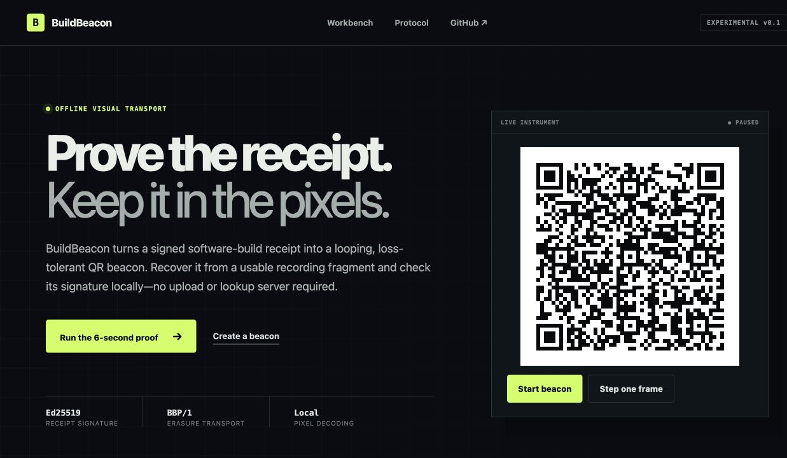
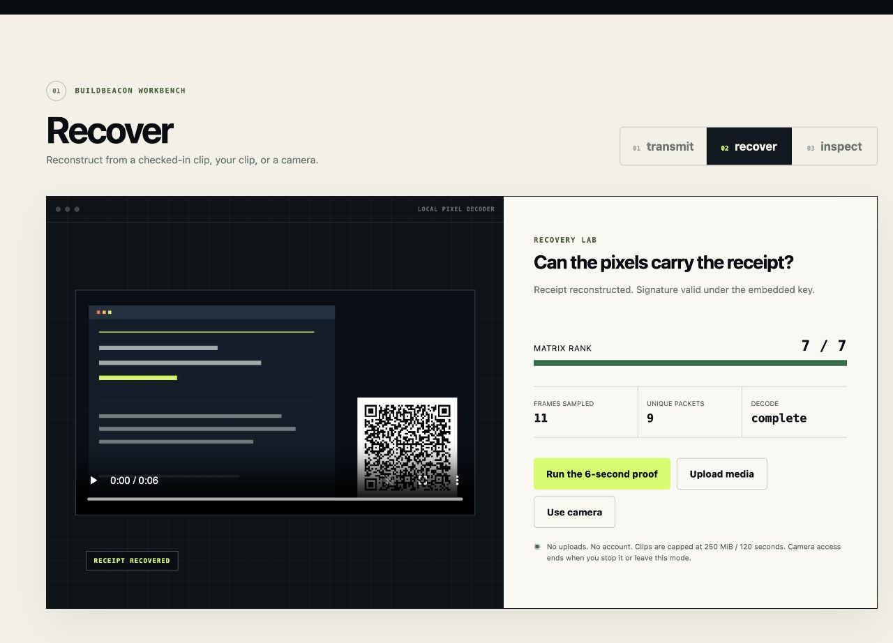

# BuildBeacon

**Visual, loss-tolerant transport for signed build receipts.**

[](https://github.com/stoicpickle/buildbeacon/actions/workflows/ci.yml)
[](LICENSE)
[](docs/PROTOCOL.md)

[Live demo](https://stoicpickle.github.io/buildbeacon/) · [Beacon Bench](docs/BEACON_BENCH.md) · [Real-footage follow-up](docs/REAL_FOOTAGE_BENCH.md) · [Platform round trips](docs/PLATFORM_ROUND_TRIPS.md) · [Protocol](docs/PROTOCOL.md) · [Threat model](docs/THREAT_MODEL.md) · [Test matrix](docs/TEST_MATRIX.md)



Build attestations normally disappear when someone screen-records a demo, trims the clip, or reposts only the pixels. BuildBeacon keeps a compact signed receipt in those pixels as a looping QR marker. A receiver can join between cycles, lose frames, reconstruct the canonical receipt, and check its Ed25519 signature without uploading the clip or contacting a lookup service.

BuildBeacon is an experimental transport, not a video-authenticity system. A valid receipt signature does **not** prove that the surrounding footage came from the claimed artifact, and a public key carried inside its own envelope does **not** establish signer identity.

## Run the six-second proof

Open the [live demo](https://stoicpickle.github.io/buildbeacon/) and select **Run the 6-second proof**.

The checked-in fixture is a real 1280×720 H.264 clip. It begins at fountain sequence 73, contains 48 rendered QR frames with 11 deliberate duplicates, and uses the same `jsQR` pixel-decoder path as uploaded clips. The current deterministic proof reconstructs after:

- 11 sampled video frames;
- 9 unique packets;
- matrix rank 7/7;
- a valid Ed25519 signature under the fixture’s public test key.



Reproduce that proof locally:

```bash
npm ci
npm run demo:verify
```

The test key is RFC 8032 public test material, and the receipt is explicitly a synthetic fixture over the repository’s real initial commit and its 13-byte README artifact. It is intentionally unsafe for real signing and provides no identity assurance.

## What the first equal-footprint benchmark found

[Beacon Bench 1](docs/BEACON_BENCH.md) compares the same signed receipt as a static BBR1 QR and an animated BBP/1 marker on the same 1280×720 moving carrier. A benchmark-only identifier QR provides an optical lower bound; it is not the shipped visible Build ID and no resolver is exercised. The matrix uses the transmitter’s 2 Hz default, full-frame pixel decoding, every sample-aligned excerpt start, two genuine H.264 transcodes, and identical 240, 280, and 320 px marker boxes.

- At 320 px, static and animated both recovered 49/49 six-second CRF 18→27 excerpts with a 25% configured sample-erasure probability. We observed no recovery difference there; animated p95 was 4.75 seconds versus 0.125 seconds for static.
- At 240 px, static recovered 0/49 while animated recovered 49/49 under both CRF 27 and CRF 35 transcodes. The static QR was already unreadable before H.264, so this is a clean density threshold that persisted through encoding—not evidence that recompression created the gap.
- At 320 px in three-second excerpts, static recovered 73/73 while animated recovered 8/73 for the sequence-73 stream slice. The complete offline payload has a real collection-time cost.
- The experimental identifier QR decoded in every excerpt and was fastest, but it contains only an ID and proves nothing about a resolver or returned provenance.

The continuation decision is narrower than “animation wins”: for this 403-byte fixture, static was simpler at the tested 280 and 320 px sizes, while BBP/1 earned a real-footage follow-up at 240 px. Receipt size, stream phase, and untested marker widths can move that boundary.

## What the real-footage follow-up found

[Real-footage Beacon Bench](docs/REAL_FOOTAGE_BENCH.md) replaced the generated carrier with a 12-second Chromium recording of BuildBeacon itself and tested the missing 260 px boundary. The controlled marker remained the only QR in the recording.

- At 240 px, static BBR1 decoded from 0/96 sampled frames and recovered 0/49 six-second excerpts. Animated BBP/1 decoded from 96/96 frames and recovered 49/49, including after a second-generation CRF 35 transcode and 25% seeded sample erasure.
- At 260 and 280 px, both transports recovered 49/49. Static was much faster once readable: p95 0.125 seconds versus 4.75 seconds for animated.
- The demonstrated benefit occurs at 240 px but not at 260 px for this exact 403-byte receipt and decoder; the tested crossover lies between those widths. It is not evidence that animated transport is preferable when static QR already fits.

The six hash-pinned artifacts were also exercised through [YouTube and Discord](docs/PLATFORM_ROUND_TRIPS.md). YouTube returned byte-different H.264 streams; Discord returned byte-different files with bit-identical H.264 streams. Neither path introduced an additional recovery failure: the 240 px static marker was already unreadable at source, the 240 px animated marker recovered 49/49 excerpts, and both transports recovered 49/49 at 260 and 280 px. This is one bounded upload/download experiment, not a broad claim about either platform or screen-recorded playback.

## How it works

```text
build claims ──dCBOR──> Ed25519 envelope ──BBP/1──> animated QR frames
                                                              │
verified receipt <── signature check <── matrix decode <── visible pixels
```

1. **Sign** — receipt claims are encoded as deterministic CBOR and signed with a domain-separated Ed25519 message.
2. **Transmit** — BBP/1 splits the signed envelope into source blocks and emits systematic plus deterministic repair symbols.
3. **Recover** — the receiver rejects corrupt or mixed frames and performs incremental Gaussian elimination over GF(2).
4. **Inspect** — transport success, signature validity, and signer trust are presented as separate results.

The marker offers three deliberately comparable forms: a short build ID, a self-contained static QR, and the loss-tolerant animated beacon. The animated form earns its visual cost only when splitting the receipt into lower-density symbols makes a constrained marker readable and the clip is long enough to collect enough distinct symbols.

## Browser app

Requirements: Node.js 22.12 or newer and npm.

```bash
npm ci
npm run dev
```

The app provides:

- **Transmit** — compose claims, create an ephemeral demo signature, choose a marker format, and download the signed receipt;
- **Recover** — decode the checked-in proof, an uploaded clip, a static QR image, or an explicitly enabled camera entirely in the tab;
- **Inspect** — review the recovered build claims, full signer fingerprint, signature status, and trust warning.

The browser signer is for demonstrations only. Its key lives only in the tab and is discarded. Persistent signing belongs in the local CLI or a properly controlled signing system.

## CLI

Build the CLI:

```bash
npm run build:cli
node dist-cli/cli.js --help
```

Create a receipt and signing key:

```bash
node dist-cli/cli.js demo --out receipt.json
node dist-cli/cli.js keygen --out buildbeacon-key.json
node dist-cli/cli.js create \
  --input receipt.json \
  --key buildbeacon-key.json \
  --out receipt.bb
```

Verify and exercise the loss-tolerant transport:

```bash
node dist-cli/cli.js verify --input receipt.bb
node dist-cli/cli.js simulate --input receipt.bb --offset 73 --loss 0.30
node dist-cli/cli.js frames --input receipt.bb --out-dir beacon-frames --count 24
```

Private key files are created with mode `0600` on POSIX systems, are rejected when group/other permission bits are present, and are ignored by the repository’s common key-file patterns. Ignore rules are not key protection. The CLI never accepts private-key bytes through a command-line value or URL.
Key generation is create-only and refuses to overwrite an existing path.

## What it proves—and what it does not

| Result | Meaning |
|---|---|
| Transport reconstructed | Enough valid, linearly independent frames produced an envelope whose digest matches the beacon ID. |
| Signature valid | The exact canonical receipt matches the Ed25519 signature under the included public key. |
| Trusted signer | Only available when a verifier pins that key through a separate trust decision. The demo does not do this. |

BuildBeacon does not authenticate the surrounding video, stop overlay copying or replay, prove a commit existed, prove tests ran, establish timestamp freshness, distribute trust, rotate or revoke keys, or recover when the marker is cropped out or unreadable. Receipt contents are visible public data, not encryption.

## Validation

```bash
npm run check          # lint, coverage-gated protocol tests, web + CLI builds
npm run demo:verify    # decode the H.264 fixture from pixels with ffmpeg + jsQR
npm run test:e2e       # browser flow and mobile-overflow proof
npm run bench:real     # recapture the browser carrier and rebuild the real-footage matrix
npm audit --audit-level=high
```

The deterministic suite covers strict dCBOR round trips, an RFC 8032 known-answer vector, domain-separated receipt signatures, one-bit tampering, QR render/decode, CRC32C rejection, duplicate and mixed frames, join-late recovery, reordering, and fixed loss. Current protocol coverage thresholds are enforced in `vitest.config.ts`.

## Status and scope

BBP/1 is experimental and has not received an independent security audit. The implementation uses `@noble/ed25519` 3.x; that current rewrite likewise does not claim a new independent audit. See [PROTOCOL.md](docs/PROTOCOL.md) for the byte format and [THREAT_MODEL.md](docs/THREAT_MODEL.md) before using it as evidence.

BuildBeacon complements—but does not currently parse, author, or verify—SLSA provenance, Sigstore bundles, GitHub artifact attestations, or C2PA manifests. A later receipt could bind the digest of one of those artifacts without replacing its native verifier.

## Contributing

Read [CONTRIBUTING.md](CONTRIBUTING.md). Security reports belong in a private GitHub Security Advisory as described in [SECURITY.md](SECURITY.md).

## License

Apache License 2.0. See [LICENSE](LICENSE) and [THIRD_PARTY_NOTICES](THIRD_PARTY_NOTICES).
