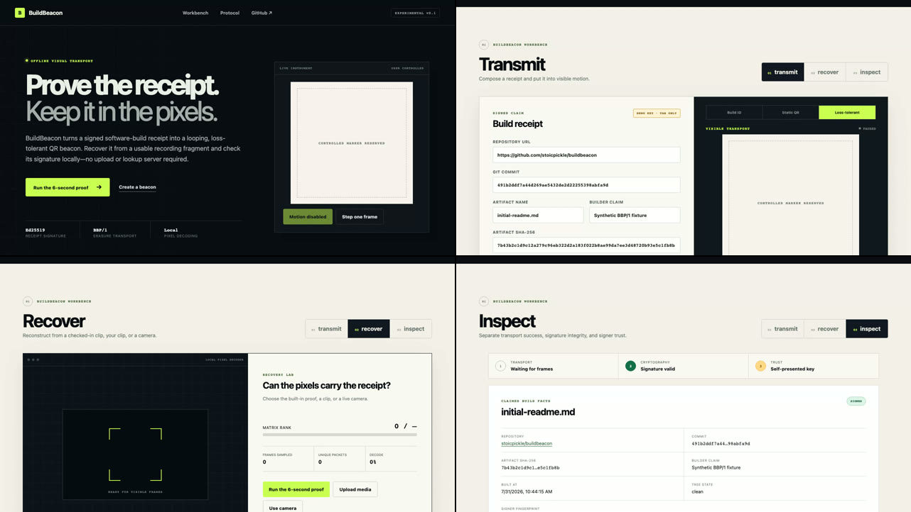

# Real-footage Beacon Bench

**Question:** Does the 240–280 px static-versus-animated crossover survive a real BuildBeacon browser recording, and are the exact artifacts ready for two platform round trips?

**Bottom line:** BBP/1 maintained at least 95% recovery through CRF 35 at 240 px; both transports reached the same bar at 260 px. The tested crossover lies between those widths on a real browser carrier and earns the prepared platform round trips.



The carrier is a real Chromium recording of the public BuildBeacon interface moving through Hero, Transmit, Recover, and Inspect. Its own demonstration QR canvases are suppressed during capture so the controlled overlay is the only machine-readable marker. This is more representative than a generated test pattern, but it is still one local browser, one screen-recording codec, and one overlay position.

Reproduce the capture and complete local matrix with Node.js 22+, ffmpeg, and a Playwright Chromium installation:

```sh
npm ci
npx playwright install chromium
npm run bench:real
```

## Six-second recovery with 25% seeded sample erasure

| Marker | Media path | Static BBR1 | Animated BBP/1 | Animated delta | Animated p95* |
|---:|---|---:|---:|---:|---:|
| 240px | upload-source | 0/49 (0.0%) | 49/49 (100.0%) | 100.0 pp | 4.750 s |
| 240px | local-crf27 | 0/49 (0.0%) | 49/49 (100.0%) | 100.0 pp | 4.750 s |
| 240px | local-crf35 | 0/49 (0.0%) | 49/49 (100.0%) | 100.0 pp | 4.750 s |
| 260px | upload-source | 49/49 (100.0%) | 49/49 (100.0%) | 0.0 pp | 4.750 s |
| 260px | local-crf27 | 49/49 (100.0%) | 49/49 (100.0%) | 0.0 pp | 4.750 s |
| 260px | local-crf35 | 49/49 (100.0%) | 49/49 (100.0%) | 0.0 pp | 4.750 s |
| 280px | upload-source | 49/49 (100.0%) | 49/49 (100.0%) | 0.0 pp | 4.750 s |
| 280px | local-crf27 | 49/49 (100.0%) | 49/49 (100.0%) | 0.0 pp | 4.750 s |
| 280px | local-crf35 | 49/49 (100.0%) | 49/49 (100.0%) | 0.0 pp | 4.750 s |

*Recovery timing starts at the first sampled frame and is reported only for successful excerpts.

## Optical decode rate before simulated sample loss

| Marker | Media path | Static frame decode | Animated frame decode |
|---:|---|---:|---:|
| 240px | upload-source | 0/96 (0.0%) | 96/96 (100.0%) |
| 240px | local-crf27 | 0/96 (0.0%) | 96/96 (100.0%) |
| 240px | local-crf35 | 0/96 (0.0%) | 96/96 (100.0%) |
| 260px | upload-source | 96/96 (100.0%) | 96/96 (100.0%) |
| 260px | local-crf27 | 96/96 (100.0%) | 96/96 (100.0%) |
| 260px | local-crf35 | 96/96 (100.0%) | 96/96 (100.0%) |
| 280px | upload-source | 96/96 (100.0%) | 96/96 (100.0%) |
| 280px | local-crf27 | 96/96 (100.0%) | 96/96 (100.0%) |
| 280px | local-crf35 | 96/96 (100.0%) | 96/96 (100.0%) |

## Fixed conditions

- Browser carrier: 1280×720, 30 fps, 12 seconds; Playwright Chromium recording normalized losslessly before marker composition.
- Marker: bottom-right with 56 px inset, 240/260/280 px square, QR error correction M, 4-module quiet zone, 2 BBP/1 symbols per second.
- Receipt: the checked-in 403-byte signed fixture, 7 source blocks of 64 bytes, beginning at sequence 73.
- Receiver: full 1280×720 frames sampled at 8 fps; all sample-aligned 6-second windows; no marker crop is supplied.
- Media paths: upload-source is H.264 CRF 18 from the browser carrier; local-crf27 and local-crf35 are second-generation H.264 transcodes of that exact file.
- The 25% loss condition erases sampled observations after optical decoding. It does not erase entire two-Hz source symbols.

## Platform round trips

Six exact upload artifacts and their SHA-256 hashes are recorded in [`../benchmarks/platform-roundtrip-manifest.json`](../benchmarks/platform-roundtrip-manifest.json). Two platform slots remain deliberately unnamed and unrun: publishing to external accounts requires an explicit platform and visibility choice. After downloading each returned set with its original test IDs, run:

```sh
npm run bench:platform -- <platform-slug> /absolute/path/to/download-directory
```

The analyzer hashes every returned file, scans whole frames, verifies recovered signed bytes, and writes a per-platform JSON result under the ignored `bench-results/real-footage/returns/` directory.

## What this does not establish

- No named social platform has been tested yet, so this report makes no platform-survival claim.
- The visible receipt can still be copied onto unrelated footage; BuildBeacon is not a video-authenticity system.
- One interface, codec stack, overlay position, receipt size, QR decoder, and recording resolution cannot establish broad reliability.

Machine-readable results: [real-footage-bench.json](../benchmarks/real-footage-bench.json). Exact upload hashes: [platform-roundtrip-manifest.json](../benchmarks/platform-roundtrip-manifest.json).
